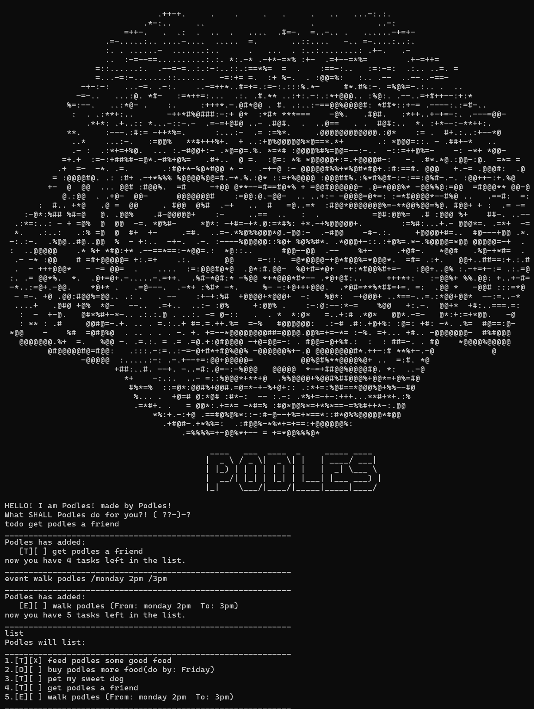

# **PodleGPT User Guide**
> PodleGPT, or Podles is YOUR personal command-line assistant, 
> Who helps tracks you tasks, deadlines or events! <br>
> > Dedicated to my very real and lovely Poodle known as ***Podles***.<br>


**PodleGPT is a desktop app for managing tasks, optimized for use via a Command Line Interface (CLI).**

---
## Quick Start

1. Ensure you have **Java 17** or above installed.
2. Download the latest `podleGPT.jar` from [here](https://github.com/podledges/ip/releases) into your prefered folder.
3. Open a command terminal, `cd` into the folder you put the jar file in
4. Use `java -jar PodleGPT.jar` to start the application

---

## Features
> **Command Format**
> * Words in `UPPER_CASE` are parameters to be supplied by the user.
> * Items in square brackets like `[INDEX...]` are optional.

### Adding Tasks: `todo`, `add`
Creates a basic task in the tracker.
* **Format:** `todo <TASK_NAME>` or `add <TASK_NAME>`
* **Example:** `todo read book`
* **Expected Output:**
  ```text
  ____________________________________________________________
  Podles has added: 
     [T][ ] read book
  now you have 1 tasks left in the list.
  ____________________________________________________________
### Adding a Deadline Task: `deadline`
Creates a task with a specific deadline. Needs a name and a time separated by `/`.
* **Format:** `deadline <TASK_NAME> /<TIME>`
* **Example:** `deadline submit assignment /by Friday 2359`
* **Expected Output:** 
```text
____________________________________________________________
  Podles has added:
  [D][ ] submit assignment (by: Friday 2359)
  now you have 2 tasks left in the list.
____________________________________________________________
```
### Adding an Event Task: `event`
Creates an event with a start and end time. Needs a name and two times separated by `/`.
* **Format:** `event <EVENT_NAME> /<START_TIME> /<END_TIME>`
* **Example:** `event project meeting /from 2pm /to 4pm`
* **Expected Output:**
  ```text
  ____________________________________________________________
  Podles has added: 
     [E][ ] project meeting (from: 2pm to: 4pm)
  now you have 3 tasks left in the list.
  ____________________________________________________________
### Listing all Tasks: `list`
List all current tasks along with their completion status.
* **Format:** `list`
  ``` text 
  Podles will list:
  ____________________________________________________________
  1.[T][ ] read book
  2.[D][ ] submit assignment (by: Friday 2359)
  3.[E][ ] project meeting (from: 2pm to: 4pm)
  ____________________________________________________________```
### Finding Tasks: `find`
Finds and lists all tasks that contain a specific keyword in their description.
* **Format:** `find <KEYWORD>`
* **Example:** `find book`
* * **Expected Output:**
  ```text
  ____________________________________________________________
  Podles will Search for:
  book
  1.[T][ ] read book
  ____________________________________________________________

### Marking Tasks: `mark`
Marks a task as completed or incomplete. <br> 
Supports marking multiple tasks, seperated by a comma or a space!
* **Format:** `mark <INDEX> [INDEX...]` 
* **Example:** `mark 1` or `mark 1, 2, 3`
* * **Expected Output:**
  ```text
  what an AMAZING job!!❀.(*´◡`*)❀       MARKED!!
* **The updated list will also be printed and will reflect the Task's completion in the output**
  ````
  1.[T][X] read book

### Unmarking Tasks: `unmark`
Same as above, but instead unmarks a completed task
* **Format:** `unmark <INDEX> [INDEX...]` 
* **Example:** `unmark 1` or `unmark 1, 2, 3`
* * **Expected Output:**
  ```text
  OOOPS   (｡•́︿•̀｡)        how did that get marked...
* The updated list will be printed, with the unmarked task listed as:
  ``` text
  1.[T][] read book

### Deleting Tasks: `delete`
Removes a task from your list permanently.
* **Format:** `delete <INDEX>`
* **Example:** `delete 2`
  ``` text
  ____________________________________________________________
  Podles has removed the task below from the list!!!!
  2.[D][ ] submit assignment (by: Friday 2359)
  You have 2 remaining tasks in the list!!
  ____________________________________________________________

### Quitting the Program: `bye`, `byebye`
Saves your data and safely exits the application. <br>

* `bye` triggers a longer exit sequence, while `byebye` triggers a quick exit
<br>
* **Format:** `bye` **or** `byebye` <br>
  <br>
  **Output of bye** 
  ``` 
  Y dont u want to play with podles .·°՞(っ-ᯅ-ς)՞°·. SADGE
  ████ 22%
  ███████ 43.3893%
  ██████████ 67.667%
  ████████████████ 89%
  █████████████████████]99%
  podles was terminated...    (╥﹏╥)```\
  ```
  **Output of byebye**
  ``` text
  deadge
  ```
  

### Command summary
The following table summarizes the available commands:

| Action | Format | Example |
| :--- | :--- | :--- |
| **ADD TODO** | `todo <TASK_NAME>` | `todo read book` |
| **ADD DEADLINE**| `deadline <TASK_NAME> /<TIME>` | `deadline submit assignment /by Friday 2359` |
| **ADD EVENT** | `event <NAME> /<TIME1> /<TIME2>`| `event project meeting /from 2pm /to 4pm` |
| **LIST** | `list` | `list` |
| **FIND** | `find <KEYWORD>` | `find book` |
| **MARK** | `mark <INDEX1>, [INDEX2]...` | `mark 1, 2, 3` |
| **UNMARK** | `unmark <INDEX1>, [INDEX2]...`| `unmark 1` |
| **DELETE** | `delete <INDEX>` | `delete 2` |
| **QUIT** | `bye` or `byebye` | `bye` |


